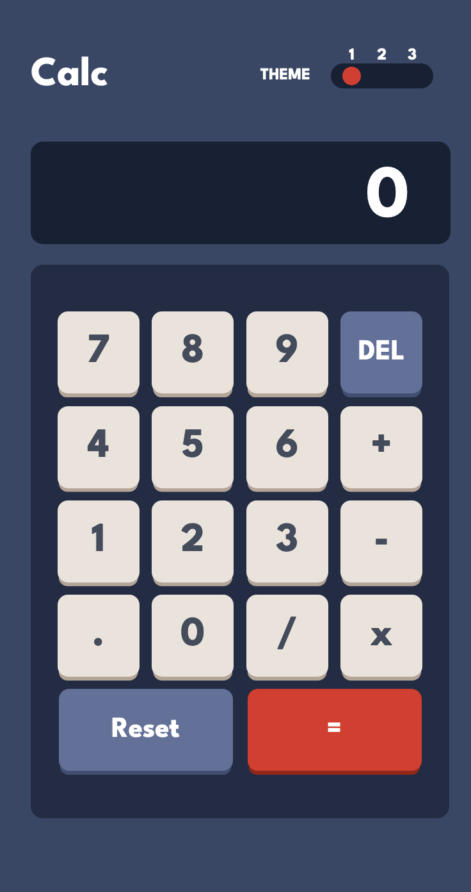

# Frontend Mentor - Calculator app solution

This is a solution to the [Calculator app challenge on Frontend Mentor](https://www.frontendmentor.io/challenges/calculator-app-9lteq5N29). Frontend Mentor challenges help you improve your coding skills by building realistic projects.

## Table of contents

-   [Overview](#overview)
    -   [The challenge](#the-challenge)
    -   [Screenshot](#screenshot)
    -   [Links](#links)
-   [My process](#my-process)
    -   [Built with](#built-with)
    -   [What I learned](#what-i-learned)
    -   [Continued development](#continued-development)
    -   [Useful resources](#useful-resources)
-   [Author](#author)
-   [Acknowledgments](#acknowledgments)

## Overview

### The challenge

Users should be able to:

-   See the size of the elements adjust based on their device's screen size
-   Perform mathmatical operations like addition, subtraction, multiplication, and division
-   Adjust the color theme based on their preference

### Screenshot

### Links

-   Solution URL: [https://github.com/ysrckr/fem-calculator]
-   Live Site URL: [https://bright-vacherin-2d37ec.netlify.app]

## My process

Program developed with React and TypeScript. First the layout is designed. After the layout with SCSS mobile version is styled. After the layout and mobile styling is done, coding of the calculator functionality is started. With React useReduce is used for the functionality. Instead of using useState and proping around.

### Built with

-   HTML5 markup
-   SCSS custom properties
-   Flexbox
-   CSS Grid
-   Mobile-first workflow
-   [React](https://reactjs.org/) - JS library
-   TypeScript
-   Vite

### What I learned

I gained more experience with React and useReducer hook. The project was good for solving problems. I had couple of problems that I stuck but I got over one but all of them.

### Continued development

The Calculator has the all of the functionality of a real calculator. Only problem it has is that you can get the result with equal button. However, I would like to find a way to over come that and be able to get the result when pressed on '+, -, \*, /' and keep on calculating. Other than this as a tecnical stand point the calculator is as I wanted so I wouldn't add anything else; however, There is some bare html on App.tsx(./src/App.tsx) and I'd like to create a component for them.

## Author

-   Website - [Yasar Cakir](https://yasarcakir.com)
-   Frontend Mentor - [@ysrckr](https://www.frontendmentor.io/profile/ysrckr)
